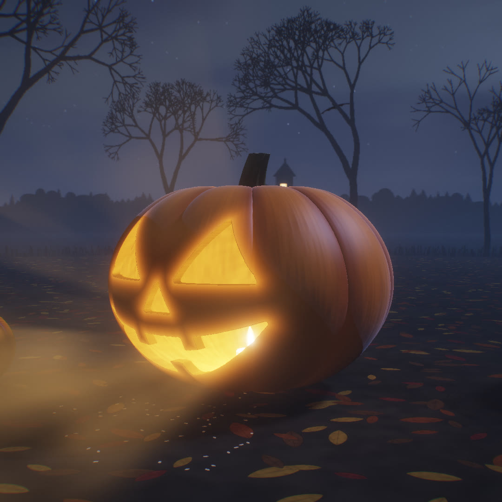

# Hallowlight



Carve a jack-o'-lantern by moonlight, right in the browser. Drag across the pumpkin and a knife follows your
cursor and cuts. Close a loop and the piece gets pushed in. Then light the candle and turn the porch light off,
and light pours out of the face into the fog.

If you leave it glowing in the dark for a while, something happens.

- `index.html` is the whole thing: one file, no build step, no 3D models, no textures, no audio files.
- `hallowlight.mp4` is a 24-second, 1080×1080 clip rendered from the same code (`?film` mode), with sound.
- `record.mjs` re-renders that clip.

## Controls

| Do this | Get this |
| --- | --- |
| Drag on the pumpkin | Cut. The ring under the cursor shows the blade width. |
| Cross your own line, or end a stroke near where it started | The loop is cut out and the piece is pushed into the pumpkin. |
| Drag the background | Walk around the pumpkin. Scroll or pinch to move closer. |
| Classic, Wicked, Startled, Bat, Surprise me | A knife carves that face on its own, then lights the candle. |
| Light candle / Blow out (C) | Strike a match inside. |
| Lights out / Lights on (L) | Switch the porch light. The candle becomes the only warm light. |
| Undo (Z), New pumpkin (N), Sound (M) | Sound is off until you turn it on. |
| Save image | A PNG of your jack-o'-lantern. |

## How it works

- **The pumpkin** is a signed distance field raymarched in a WebGL2 fragment shader: a squashed ellipsoid
  whose radius dips along 10 creases, hollowed into a thin shell, with a curved stem, a zigzag lid cut and a
  candle inside.
- **Carving** draws your strokes into a 512×512 canvas, then turns it into a signed distance field on the CPU
  (Felzenszwalb–Huttenlocher exact Euclidean distance transform) every time the cut changes. The shader
  subtracts that field from the shell, extruded front-to-back, so cuts have real walls, lit flesh and soft
  edges at any zoom. A second channel holds the piece that is being pushed in.
- **Candlelight leaving the cuts**: for any point in the scene, the shader intersects the segment from the
  flame to that point with ellipsoids fitted to the shell, looks up whether the exit points are in a cut, and
  lights the point if they are. That one test lights the ground, the other pumpkins, the knife and the fog.
- **The light shafts** are single-scattering through drifting 3D noise fog, integrated with equiangular
  sampling (Kulla & Fajardo 2012), which spends samples where the point light is close. 22 samples per pixel
  are enough in real time.
- **The night** is a sky with a textured moon, clouds, stars and bats, plus two silhouette layers (bare trees,
  a fence, a ridge with a house) generated on a canvas at load and wrapped around the scene at two distances
  so they parallax as you orbit.
- **Post**: an HDR buffer, a 6-level bloom chain, ACES tone mapping, a slight cool shadow grade, vignette and
  grain. Resolution adapts to keep the frame rate up.
- **Sound** is synthesized with Web Audio: wind, crickets, an owl, the knife sawing, the pop of a piece going
  in, a match strike, candle crackle, the porch switch, and a drone for the dark.

## Render the clip

```sh
npm i playwright && npx playwright install chromium
node record.mjs                                  # 1080x1080, 30 fps -> hallowlight.mp4
node record.mjs --size 720 --quality 2 --out preview.mp4
```

Frames render in headless Chromium (software WebGL works, about 3 s per frame at 1080p) and are cached, so
an interrupted render resumes. The soundtrack is rendered with an `OfflineAudioContext` from the same sound
code the page uses, then ffmpeg muxes both into an H.264/AAC MP4 that X/Twitter accepts as is.

## Posting it

Host `index.html` anywhere static (GitHub Pages works: Settings → Pages → deploy from this branch, folder `/`,
then open `/hallowlight/`). Some copy to start from:

> I made a jack-o'-lantern you carve in your browser. Drag to cut, close a loop to push the piece in, light
> the candle, turn the porch light off.
>
> Then leave it in the dark for a bit. 🎃

> Spooktober build: a raymarched pumpkin you carve with your mouse. The cuts are a live distance field,
> the candle shines through them into volumetric fog, and every sound is synthesized. One HTML file, no assets.

> No 3D models, no textures, no audio files. Just one HTML file, a shader, and a pumpkin that is very
> patient with you. 🎃🔪
